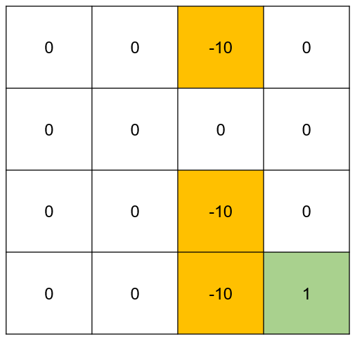

# Grid World Value Iteration

## Overview

This repository contains an implementation of the Value Iteration algorithm for solving the Grid World problem. The Grid World problem involves navigating a robot through a grid to reach a goal state while minimizing penalties associated with moving and avoiding undesirable states.

## Problem Description

Consider a robot navigating in a grid-based environment. Each cell in the grid represents a distinct state of the surroundings. The robot can take four deterministic actions at each cell: "up," "down," "left," and "right," resulting in the robot to move precisely one cell in the corresponding direction on the grid. Actions that would take the agent off the grid are not allowed. Within the grid, certain states (orange) correspond to undesirable conditions, such as rough terrain, while one state (green) represents the ultimate goal.

Upon reaching the goal state, the robot gains a reward of 1. Conversely, traversing the rough terrain incurs a penalty (or negative reward) of 10. Additionally, every move the robot makes entails a penalty of 1. The robot's primary objective is to efficiently reach the goal state, aiming to maximize the total reward (minimize the total penalty) incurred. This entails both avoiding the rough terrain and efficiently navigating through the grid.



In the Grid World environment:
- Each cell represents a state with associated rewards or penalties.
- The robot can move "up", "down", "left", or "right".
- Moving off the grid is not allowed.
- The goal is to reach the final state with maximum reward while minimizing penalties.

### Rewards and Penalties
- **Goal State**: Reward of +1.
- **Rough Terrain**: Penalty of -10.
- **Each Move**: Penalty of -1.

## Implementation

### Value Iteration Algorithm

The Value Iteration algorithm iteratively updates the value function for each state based on the expected rewards of possible actions. The process continues until the value function converges.


### Requirements

- **Python 3.x**
- **NumPy**

### Installation

1. Clone the repository:
   ```bash
   git clone https://github.com/Mahmood-Anaam/grid-world-value-iteration.git
   ```

2. Navigate to the project directory:
   ```bash
   cd grid-world-value-iteration
   ```

3. Install the required packages:
   ```bash
   pip install numpy
   ```
